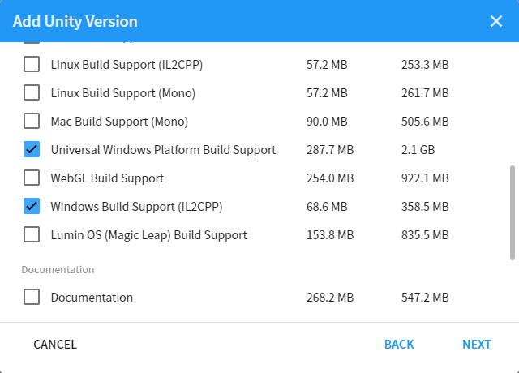

# Setting up :material-unity:  Unity

Unity is a cross-platform game engine developed by Unity Technologies. The V-ROOM Team mainly uses this game engine to build the virtual environment for our virtual classrooms and more!

---

## Getting Started

To get started with Unity, you should install it on your machine. See below for the version that we are using! 

##### Download Unity Editor

=== "`2019.4.8f1`"
	Download version `2019.4.8f1`  [Get on :material-unity: hub](unityhub://2019.4.8f1/60781d942082){.md-button .md-button--primary}  [:material-microsoft-windows: 64-bit](https://download.unity3d.com/download_unity/60781d942082/Windows64EditorInstaller/UnitySetup64-2019.4.8f1.exe){.md-button}  [:material-apple:](https://unity3d.com/get-unity/download?thank-you=update&download_nid=64071&os=Mac){.md-button}

=== "`2019.4.31f`"
	Download version `2019.4.31f1`  [Get on :material-unity: hub](unityhub://2019.4.31f1/bd5abf232a62){.md-button .md-button--primary} [:material-microsoft-windows: 64-bit](https://download.unity3d.com/download_unity/bd5abf232a62/Windows64EditorInstaller/UnitySetup64-2019.4.31f1.exe){.md-button} [:material-apple:](https://unity3d.com/get-unity/download?thank-you=update&download_nid=65206&os=Mac){.md-button}

!!! Info
    Since I'm using a :material-microsoft-windows: operating system, this tutorial will show the process in :material-microsoft-windows: computer.  If you are using :material-apple: , the process should be similar, but if there's anything you're not sure about, [Google](https://www.google.com/ncr) is your friend! :slightly_smiling_face:

---

## Installation Walkthrough

There are two ways to install Unity on your machine: via [:material-link: Unity Hub](#unity-hub) or  [:material-link: Standalone install](#standalone-installation).

---

#### Unity Hub

Installing through Unity Hub is the most recommended method as it is simple and straightforward! 

!!! info "You need to have Unity Hub installed to proceed."

!!! Warning "Unity Hub requires internet connection to download the Editor files for installation"

Open Unity Hub :material-arrow-right:  Navigate to the `Installs` tab on the left :material-arrow-right:  Click on `Add` button to add the version of Unity Editor that you need.

Select the version that you need (`2019.4.8f1`) :material-arrow-right:  Click `next`.

Now select all the modules that you need.

<table>
    <tr>
    	<td></td>
        <td></td>
    </tr>
</table>
  

!!! info "See the table below to see which modules you need to develop each platform"
   

|                                  |        PC        |        VR        |     HoloLens     |     Android      |
| -------------------------------- | :--------------: | :--------------: | :--------------: | :--------------: |
| Windows Build Support            | :material-check: | :material-check: | :material-check: | :material-check: |
| Universal Windows Build Platform |                  |                  | :material-check: |                  |
| Android Build Support            |                  |                  |                  | :material-check: |

!!! tip
    We highly recommend you to also install `Microsoft Visual Studio Community`.  **Visual Studio** is an integrated development environment (IDE) that most people use when developing in Unity. It is natively supported in Unity to provide you with an easy and fast access when you need to code.

When you're done, click `next`.

Check the box `I have read and agree...` and click `next`. (Feel free to read the EULA given in the link :D )

Do the same thing with the Android EULA (if you choose to install it) and then press `Done`.

<table>
    <tr>
    	<td></td>
        <td></td>
    </tr>
</table>

Wait until the installation finishes. This may take several minutes to several *hours*, depending on which module(s) you have chosen.

And... you're done!

!!! Tip "You can have multiple version of the Unity Editor installed at any time!"

!!! Info "You can add modules from the editor by clicking on the :material-dots-vertical: button and select `Add Modules`"

---

#### Standalone Installation

The standalone installation is typically used when you can't find the Unity version you need since it might already been replaced by a new version or when there are issues with installing using the Unity Hub. This includes:

* Going to :material-unity: Archive
* Downloading an executable installer .exe (:material-microsoft-windows:) / .dmg (:material-apple:)
* Installing Unity Editor
* Locating the editor on Unity Hub

!!! Note
    You still need to have `Unity Hub` already installed on your machine, since we're going to locate the installed editor on the Hub.

!!! Warning "Important Note"
    Whenever possible, use Unity Hub to install the Editor. Standalone installation may be confusing for most users and you might select something you're not supposed to.

!!! question "Did you know?"
    You can select :fontawesome-solid-download: **Unity Hub** to install the archived versions on Unity Hub instead of downloading a separate executable installer. It's less hassle, really!

---

##### Visit the Unity Archive

So you have decided to standalone install Unity Editor, great!  The first thing to do is to go to the :material-unity: archive and select your :material-unity: version.

[Visit Unity Archive :material-arrow-top-right:](https://unity3d.com/get-unity/download/archive){.md-button}

Download `Unity Installer` for the version you need (`2019.4.8f1`). 

If you only need the editor without any modules, download the `Unity Editor 64-bit`for Windows or `Unity Editor` for Mac.

---

##### Unity Install Assistant

!!! Warning "Important Note"
    The Unity Download Assistant **requires** internet connection to download the editor files for installation. Make sure you have a working internet connection.

Locate the file you have downloaded and open it.

The name should be something like `UnityDownloadAssistant-2019.4.8f1.exe`. 

Click `next` :material-arrow-right:  check the `I accept ...`  :material-arrow-right:  `next`.

<table>
    <tr>
    	<td></td>
        <td></td>
    </tr>
</table>

Select all the modules you need - you can refer to the picture below or check the [:material-link: table](#modules-table).

Select where you want to download the installation files (temporary) and the install location. Click `next` when you're done.

Wait for the installation to finish and then click on `Finish`. You have successfully installed the Unity Editor.

---

##### Unity Editor Offline Installer

This one is very straightforward. 

After you download the installer, open it. The file should be named something like `UnitySetup64-2018.4.8f1.exe`.

Follow the instruction on screen. Choose where you want to install it. Once finished you have successfully installed the editor.

---

##### Locating on Unity Hub

Now, you need to locate the newly installed editor on Unity Hub.

Open Unity Hub and navigate to the `Installs` section :material-arrow-right: click on `Locate`. 

Locate the `Unity.exe` in the location where you install the editor. It will be inside the `Editor` folder.

Select `Unity.exe` and then click `Select Editor`.

You should now have the editor in your Unity Hub.

---

## Unity License

If you have not yet activated a license to use Unity, see below.

!!! Danger "Note"
    You need a Unity ID to manage your license. <a href="https://id.unity.com/en/" target="_blank">`Create Unity ID`</a>

#### Activating Unity License

Go to your profile on the top right corner :material-arrow-right: `Manage license`

Click on `Activate New License` :material-arrow-right:  `Unity Personal` :material-arrow-right:  `I don't use Unity in...` :material-arrow-right:  `Done`

**You have successfully activated your new license!**

---

[Home](/../)