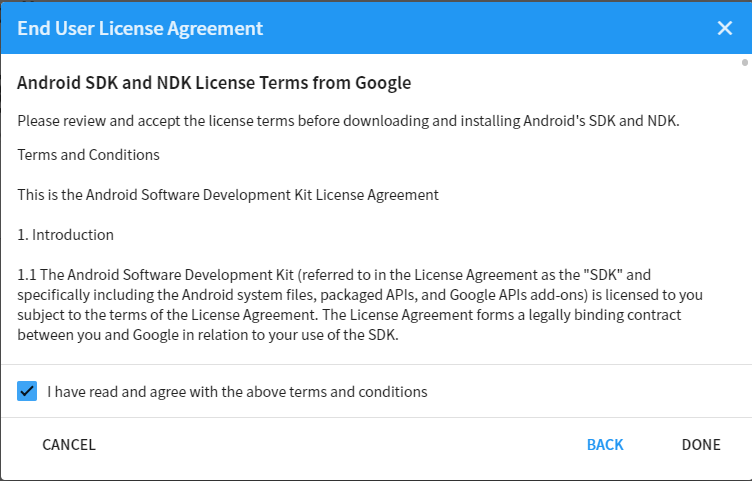

# Setting up Embedded Browser (by Zen Fulcrum LLC)

The Embedded Browser provides an easy solution to rendering webpages in your Unity project. It supports both PC and VR mode.

[View in Asset Store](https://assetstore.unity.com/packages/tools/gui/embedded-browser-55459#)

---

## Getting Started

To get started with Embedded Browser, you should install it on your machine. See below for the version that we are using!  

##### Download Unity Editor

`2019.8.4f1` &nbsp;&nbsp;&nbsp;&nbsp; [Unity Hub](https://unity3d.com/get-unity/download) &nbsp;&nbsp; | &nbsp;&nbsp; [Editor (Win)](https://download.unity3d.com/download_unity/9bc9d983d803/Windows64EditorInstaller/UnitySetup64-2018.4.8f1.exe)  &nbsp;&nbsp; | &nbsp;&nbsp; [Editor (Mac)](https://unity3d.com/get-unity/download?thank-you=update&download_nid=62959&os=Mac)

...or [`click here`](unityhub://2019.4.8f1/60781d942082) to install directly if you already have Unity Hub!

---

## Installation Walkthrough

There are two ways to install Unity on your machine: via [`Unity Hub`](#unity-hub) or  [`standalone installation`](#standalone-installation).

#### Unity Hub

Installing through Unity Hub is the most recommended method as it is simple and straightforward! 

You need to make sure that you have Unity Hub installed already on your machine to proceed.

Open Unity Hub &#8594;  Navigate to the `Installs` tab on the left &#8594;  Click on `Add` button to add the version of Unity Editor that you need.

Select the version that you need (`2019.4.8f1`) &#8594;  Click `next`.

Now select all the modules that you need.

Since we are developing for both mobile and PC version, go ahead and check `Android Build Support`, `Universal Windows Platform Build Support`, and `Windows Build Support`.

We highly recommend you to also install `Microsoft Visual Studio Community`. Visual Studio is an integrated development environment (IDE) that most people use when developing in Unity. It has been integrated directly into Unity to provide you with an easy and fast access when you need to code.

<table>
    <tr>
    	<td></td>
        <td></td>
    </tr>
</table>

When you're done, click `next`.

Check the box `I have read and agree...` and click `next`. (Feel free to read the EULA given in the link :D )

Do the same thing with the Android EULA and then press `Done`.

<table>
    <tr>
    	<td></td>
        <td></td>
    </tr>
</table>

Wait until the installation finishes. This may take several minutes to several hours, depending on which module(s) you have chosen.

And... you're done!

#### Standalone Installation

The standalone installation is typically used when you can't find the Unity version you need since it might already been replaced by a new version or when there are issues with installing using the Unity Hub. This includes downloading and executable installer (.exe), installing, and locating on Unity Hub.

Unity Archive [Download](https://unity3d.com/get-unity/download/archive).

You need to have `Unity Hub` already installed on your machine.

Download `Unity Installer` for the version you need (`2019.4.8f1`). 

If you only need the editor without any modules, download the `Unity Editor 64-bit`for Windows or `Unity Editor` for Mac.

##### Unity Install Assistant

**Note: ** The Unity Installer **requires** the internet to download the editor files for installation. Make sure you have adequate internet connection.

Locate the file you have downloaded and open it.

The name should be something like `UnityDownloadAssistant-2019.4.8f1.exe`. 

Click `next` &#8594;  check the `I accept ...`  &#8594;  `next`.

<table>
    <tr>
    	<td></td>
        <td></td>
    </tr>
</table>

Select all the modules you need - you can refer to the picture below.

Select where you want to download the installation files (temporary) and the install location. Click `next` when you're done.

Wait for the installation to finish and then click on `Finish`. You have successfully installed the Unity Editor.

##### Unity Editor

This one is very straightforward. 

After you download the installer, open it. The file should be named something like `UnitySetup64-2018.4.8f1.exe`.

Follow the instruction on screen. Choose where you want to install it. Once finished you have successfully installed the editor.

##### Locating on Unity Hub

Now, you need to locate the newly installed editor on Unity Hub.

Open Unity Hub and navigate to the `Installs` section &#8594; click on `Locate`. 

Locate the `Unity.exe` in the location where you install the editor. It will be inside the `Editor` folder.

Select `Unity.exe` and then click `Select Editor`.

You should now have the editor in your Unity Hub.

---

## Unity License

If you have not yet activated a license to use Unity, see below.

**You need a Unity ID to manage your license.** <a href="https://id.unity.com/en/" target="_blank">`Create Unity ID`</a>

[Create Unity ID]: https://id.unity.com/en/	"Create Unity ID"

#### Activating Unity License

Go to your profile on the top right corner &#8594; `Manage license`

Click on `Activate New License` &#8594;  `Unity Personal` &#8594;  `I don't use Unity in...` &#8594;  `Done`

**You have successfully activated your new license!**

---

[Home](/../)